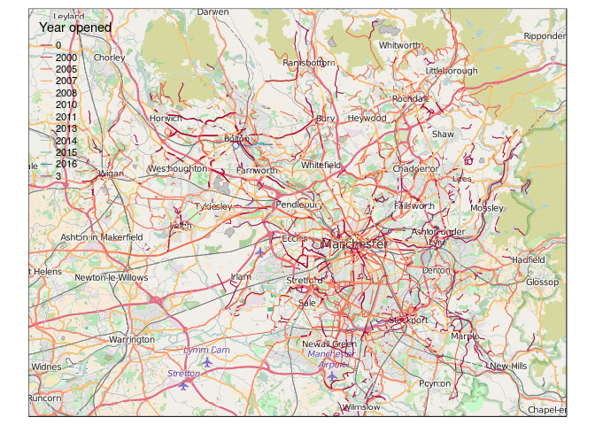

Welcome to the transportDataManchester repo
===========================================

<!-- README.md is generated from README.Rmd. Please edit that file -->
This is a package to ease the access and analysis of open transport data in Manchester. It comes pre-installed with some datasets and automatically installs some useful software for visualising spatial data on your computer.

Pre-requisites
--------------

Recent versions of R (which can be downloaded [here](https://www.r-project.org/)) and [RStudio](https://www.rstudio.com/products/rstudio/download/).

This is free software that works on Linux, Mac and Windows.

It is suggested you get up-to-speed with RStudio, for example with reference to this tutorial: <https://github.com/Robinlovelace/Creating-maps-in-R> (Lovelace et al. 2014)

Installation
------------

Open RStudio and enter the following, to install the 'devtools' package:

``` r
install.packages("devtools")
```

Then you can install this package:

``` r
devtools::install_github("robinlovelace/transportDataManchester")
```

Load it as follows:

``` r
library(transportDataManchester)
```

Using the package
-----------------

The package comes with a number of datasets pre-installed. To see them try:

``` r
data(package = "transportDataManchester")
```

To plot the cycle path data, for example, try the following:

``` r
library("tmap") # load mapping package
data("cycle_routes")
osm_tiles = read_osm(bb(cycle_routes))
cycle_routes$`Year opened` = as.character(cycle_routes$OpeningYea)
qtm(osm_tiles) +
  tm_shape(cycle_routes) +
  tm_lines(col = "Year opened", palette = "Spectral")
```



References
----------

Lovelace, R., & Cheshire, J. (2014). Introduction to visualising spatial data in R.
